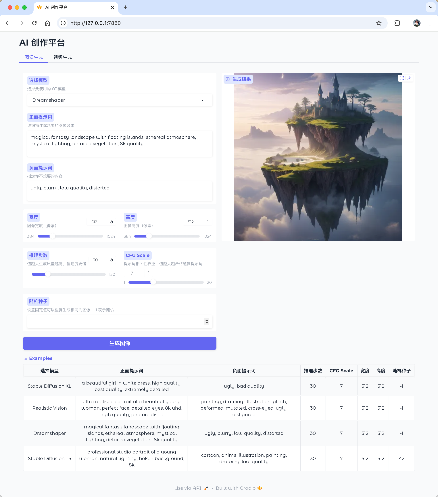
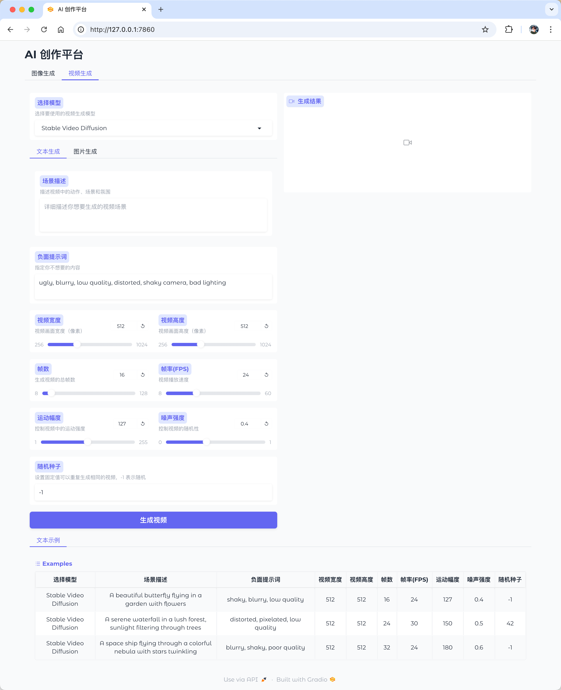

# SD Chat - AI Creation Platform

[English](README.md) | [简体中文](README_zh.md)

An AI creation platform based on Stable Diffusion, supporting both image and video generation. This project integrates multiple advanced AI models and provides a user-friendly web interface for creating high-quality AI-generated images and videos.

## Demo




## Roadmap

### Completed Features ✅

#### 1. Text-to-Image
- [x] Stable Diffusion XL Base 1.0
- [x] Stable Diffusion 1.5
- [x] Realistic Vision V5.1
- [x] Dreamshaper V8
- [x] Custom prompt support
- [x] Parameter adjustment
- [x] Negative prompt support

#### 2. Text-to-Video
- [x] Stable Video Diffusion
- [x] Custom prompt support
- [x] Video parameter adjustment
- [x] Negative prompt support

#### 3. Image-to-Video
- [x] Stable Video Diffusion
- [x] Custom initial image support
- [x] Video parameter adjustment
- [x] Motion intensity control

### Under Development 🚧

#### 4. Image Editing
- [ ] ControlNet support
- [ ] Image inpainting
- [ ] Image outpainting
- [ ] Prompt-based editing

#### 5. Video Editing
- [ ] Video restoration
- [ ] Video style transfer
- [ ] Frame interpolation
- [ ] Video upscaling

## Features

### 1. Image Generation
- Multiple high-quality models:
  - Stable Diffusion XL
  - Stable Diffusion 1.5
  - Realistic Vision
  - Dreamshaper
- Custom generation parameters
- High-quality output
- Batch generation support

### 2. Video Generation
- Based on Stable Video Diffusion
- Image-to-video conversion
- Text-to-video generation
- Adjustable video parameters

### 3. Interface Features
- Intuitive web interface
- Real-time preview
- Parameter control
- Example prompts

## Quick Start

### Requirements
- MacOS (Apple Silicon)
- Python 3.10+
- 32GB RAM (recommended)
- Disk space: 20GB minimum (for model storage)

### Installation

1. Install Conda (skip if already installed):
```bash
# Download Miniforge3 (for Apple Silicon)
curl -L -O "https://github.com/conda-forge/miniforge/releases/latest/download/Miniforge3-MacOSX-arm64.sh"
bash Miniforge3-MacOSX-arm64.sh
```

2. Create and activate environment:
```bash
# Create Python 3.10 environment
conda create -n diffusers python=3.10
conda activate diffusers
```

3. Install PyTorch (with MPS acceleration):
```bash
# Install PyTorch with MPS support
conda install pytorch torchvision torchaudio -c pytorch-nightly
```

4. Clone the project:
```bash
git clone https://github.com/samzong/sd-chat.git
cd sd-chat
```

5. Install dependencies:
```bash
pip install -r requirements.txt
```

### First Run

1. Start the service:
```bash
python run.py
```
Initial run will automatically download required models, which may take some time depending on your network connection.

2. Access the interface:
Open http://localhost:7860 in your browser

### Project Structure
```
sd-chat/
├── run.py          # Unified startup script (recommended)
├── api.py          # Image generation service
├── video_api.py    # Video generation service
├── web_ui.py       # Web interface
└── requirements.txt # Project dependencies
```

## Contributing

Issues and Pull Requests are welcome to help improve the project.

[中文文档](README_zh.md)
